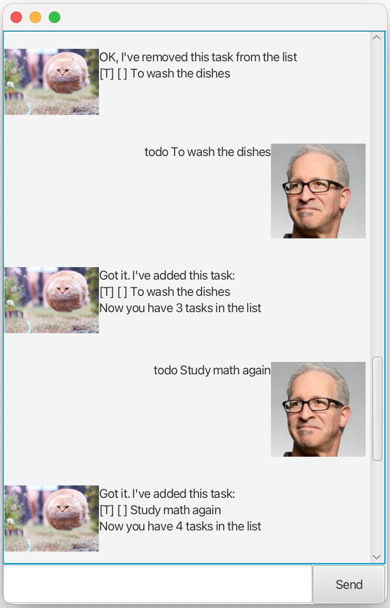

# Boink User Guide



#### Boink is an efficient task management Chatbot that will help make your daily life easier!

## Add Task

### todo: `todo`
Adds a task without deadline.

Format: `todo [DESCRIPTION]`

Examples:
`todo To wash the dishes`

Expected Outcome:
```
Got it. I've added this task: 
[T] [ ] To wash the dishes 
Now you have 1 tasks in the list!
```

### deadline: `deadline`
Adds a task with a deadline. 

Format: `deadline [DESCRIPTION] /by [DEADLINE (dd/MM/yyyy HHmm)]`

Examples:
`deadline Wash my clothes /by 03/08/2025 1430`

Expected Outcome:
```
Got it. I've added this task:
[D] [ ] Wash my clothes by 03 Aug 2025 14:30 
Now you have 2 tasks in the list!
```

### event: `event`
Adds a task with a start date and end date

Format: `event [DESCRIPTION] /from [START (dd/MM/yyyy HHmm)] /to [END (dd/MM/yyyy HHmm)]`

Examples:
`event Study math /from 03/08/2025 1400 /to 03/08/2025 1800`

Expected Outcome:
```
Got it. I've added this task: 
[E] [ ] Study math from 03 Aug 2025 14:00 to 03 Aug 2025 18:00 
Now you have 3 tasks in the list!
```

## List Tasks

### list: `list`

Prints list of all tasks in task list

Format: `list`

Expected Outcome:
```
Here are the tasks in your list:
1. [T] [ ] To wash the dishes 
2. [D] [ ] Wash my clothes by 03 Aug 2025 14:30 
3. [E] [ ] Study math from 03 Aug 2025 14:00 to 03 Aug 2025 18:00 
```

## Mark Task

### mark: `mark`

Marks task at specified index as done

Format: `mark [INDEX]`

Examples:
`mark 1`

Expected Outcome:
```
Nice! I've marked this task as done:
[T] [X] To wash the dishes 
```

## Unmark Task

### unmark: `unmark`

Unmarks task at specified index as not done

Format: `unmark [INDEX]`

Examples:
`unmark 1`

Expected Outcome:
```
OK, I've marked this task as not done yet:
[T] [ ] To wash the dishes 
```

## Delete Task

### delete: `delete`

Deletes the task at specified index

Format: `delete [INDEX]`

Examples:
`delete 1`

Expected Outcome:
```
OK, I've removed this task from the list:
[T] [ ] To wash the dishes 
```

## Find Tasks

### find: `find`

Prints list of tasks containing keyword

Format: `find [KEYWORD]`

Examples:
`find math`

Expected Outcome:
```
Here are the matching tasks in your list:
1. [E] [ ] Study math from 03 Aug 2025 14:00 to 03 Aug 2025 18:00 
2. [T] [ ] Study math again
```

## Archive Tasks

### archive: `archive`

Archives all tasks into a new file and creates a fresh, empty TaskList

Examples:
`archive`

Expected Outcome:
`Archived 3 tasks successfully!`

## End

### bye: `bye`

Prompts Boink to end the program

Expected Outcome:
```
Exiting from Boink...
```

